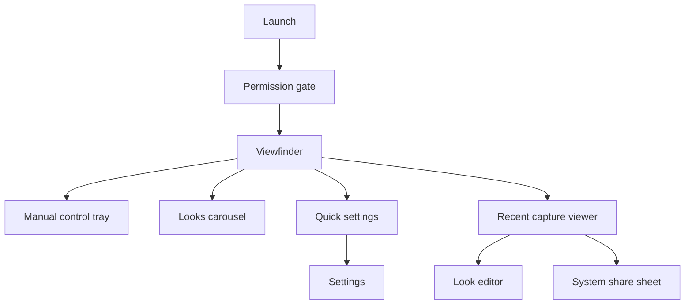
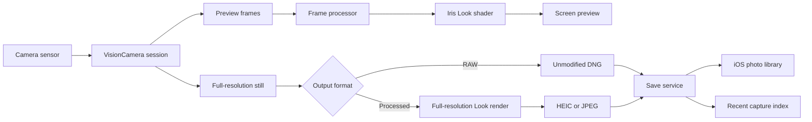

# Iris Camera

## Product requirements document

**Status:** Draft — in development, no released app  
**Version:** 1.2 
**Target:** iPhone  
**Project:** Iris  
**Last updated:** August 5, 2026

> Iris is under active development. There is no App Store listing, TestFlight build, or public consumer download yet. This PRD describes the product being built.

## 1. Product summary

Iris is an iPhone camera for photographers who want fast automatic capture, direct manual control, and distinctive photographic looks in one focused interface.

The product takes inspiration from the deliberate shooting experience of Leica LUX, Halide, and ProCamera, but it must use original Iris branding, visual design, look names, color recipes, and lens simulations. Leica names, trademarks, proprietary color science, and proprietary lens profiles must not be copied.

### Product promise

> Open Iris, choose a look, and take a finished photograph—or take direct control of exposure, focus, and white balance without leaving the viewfinder.

### Initial product decisions

- iPhone only.
- Still photography only for v1.
- Live viewfinder looks are required.
- Development and QA use a physical iPhone and a custom Expo development build.
- Core capture should work without an account or network connection.

## 2. Problem

The stock iPhone Camera is fast but hides most photographic controls. Pro camera apps often expose those controls through dense interfaces, while filter apps usually apply a style only after capture. Photographers must choose between speed, control, and a coherent visual signature.

Iris should combine:

1. A dependable automatic camera.
2. Understandable manual controls.
3. A live, accurate preview of original Iris Looks.
4. A restrained interface that stays out of the frame.

## 3. Audience

### Primary personas

#### The mobile enthusiast

Shoots daily, understands exposure basics, and wants a recognizable style without editing every image.

**Job:** “Let me see the finished look before I press the shutter.”

#### The street photographer

Values speed, discreet operation, predictable exposure, and a small set of focal-length shortcuts.

**Job:** “Let me lock my settings and capture immediately.”

#### The manual-control learner

Wants to learn ISO, shutter speed, focus, and white balance through direct manipulation and clear feedback.

**Job:** “Show me what each setting changes without overwhelming me.”

#### The working photographer

Uses the iPhone as a scouting or secondary camera and needs RAW output, reliable metadata, and repeatable settings.

**Job:** “Give me an editable file and do not silently change my locked controls.”

## 4. Goals and non-goals

### Goals

- Make capture available within two seconds of a warm launch on a supported device.
- Support automatic and manual still photography from the same viewfinder.
- Provide hardware-dependent control of ISO, exposure duration, focus position, white balance, exposure compensation, and zoom.
- Render the selected Iris Look in the live viewfinder and produce a visually matching processed photo.
- Save photos reliably to the system photo library.
- Preserve the user’s last shooting mode, lens, look, and manual settings.
- Adapt controls to the capabilities and safe ranges reported by each camera device.
- Keep core capture offline and private by default.

### Non-goals for v1

- Video recording.
- Android support.
- Social feeds, messaging, or public profiles.
- Cloud backup or cross-device synchronization.
- Desktop editing.
- Third-party camera or grip hardware integration.
- Computational lens emulations that claim to reproduce a specific Leica product.
- True physical aperture control; iPhone camera aperture is fixed.
- Replacing a full RAW editor.

## 5. Product principles

1. **The frame comes first.** Controls should not obscure the subject longer than necessary.
2. **Manual means locked.** Iris must never silently override a setting the user explicitly locked.
3. **Preview honestly.** The saved processed image should closely match the live Look preview.
4. **Respect the hardware.** Display only controls and ranges supported by the active device and format.
5. **Fast by default, deep on demand.** Auto mode should be immediately usable; advanced controls should be one gesture away.
6. **Original, not imitative.** Iris can serve the same user need as Leica LUX without copying its protected assets or proprietary profiles.
7. **Feel like an optical instrument.** The interface should be calm, precise, tactile, and immediately readable against a live photographic image.

## 6. Scope and priority

Priority meanings:

- **P0:** Required for the first public release.
- **P1:** Important, but may follow the first release.
- **P2:** Exploratory or later-phase work.

### 6.1 Permissions and first run

#### P0 requirements

- Explain why camera access is required before showing the iOS prompt.
- Request camera permission only when the user proceeds.
- Request photo-library add permission when the first photo is saved, not at initial launch.
- If permission is denied, show a clear recovery screen with a link to iOS Settings.
- Do not require sign-in.
- Show a short gesture guide after permission is granted; it must be dismissible and available later in Settings.

#### Acceptance criteria

- The user can understand and recover from every permission state.
- Denying photo-library access does not crash the camera; Iris keeps the captured temporary file long enough to retry or share.
- Permission copy accurately describes local photo handling.

### 6.2 Viewfinder and capture

#### P0 requirements

- Full-screen rear-camera preview in portrait and landscape device orientations.
- Large shutter control reachable with either thumb.
- Front/rear camera switch when a supported front camera is available.
- Tap the preview to set an autofocus and autoexposure metering point.
- Press and hold a metering point to lock supported auto controls.
- Show capture-in-progress and save-failure states without blocking the next valid action indefinitely.
- Prevent duplicate captures while the capture pipeline is busy.
- Show the most recent successful capture as a thumbnail.
- Offer grid overlays: off, thirds, square, and golden ratio.
- Offer a level indicator that settles rather than flickers.
- Optional shutter sound, subject to iOS silent-mode and regional rules.
- Visual shutter feedback is mandatory. Haptic feedback is best-effort because iOS may suppress Taptic Engine output while the camera is active.

#### P1 requirements

- Live luminance histogram.
- Highlight clipping zebras with an adjustable threshold.
- Focus peaking with selectable color and intensity.
- Optional edge-safe framing guides.

#### Acceptance criteria

- A shutter tap creates exactly one photo.
- Rotation does not produce a wrongly oriented saved image.
- Viewfinder overlays never appear in the saved image.
- A failed save leaves the app usable and gives the user a retry path.

### 6.3 Shooting modes

Iris has two top-level modes.

#### Auto mode — P0

- Iris controls exposure, focus, and white balance.
- The user can set a focus/exposure point and adjust exposure compensation.
- Exposure compensation uses the active device’s supported minimum, maximum, and neutral value.
- The selected Look, lens shortcut, format, and grid remain available.

#### Manual mode — P0

- The control tray contains shutter speed, ISO, focus, white balance, and exposure compensation where supported.
- Each manual control has an **Auto** state and a **Locked** state.
- Selecting a manual value locks that control.
- Returning a control to Auto resumes the camera’s automatic behavior.
- The current value is visible without opening the full dial.
- Out-of-range values are never sent to the camera.
- When one control changes the valid range of another, Iris clamps safely and tells the user.

#### Aperture mode — P2

“Aperture” is a simulated depth effect, not control of a physical iris.

- Present an f-stop-style creative control, clearly labeled as simulated.
- Use available depth or subject segmentation to separate the subject.
- Apply background blur with a lens-inspired but original Iris rendering profile.
- Preserve the original image or depth information so the simulated aperture can be changed later.
- If adequate depth information is unavailable, disable the mode with a concise explanation rather than producing a misleading result.

### 6.4 Manual controls

#### Shutter speed / exposure duration — P0

- Present familiar photographic steps, filtered to the active camera’s valid range.
- Include Auto and common values from fast fractions through long exposures where supported.
- Show a tripod warning at a configurable slow-shutter threshold.
- Disable incompatible high-resolution or multi-frame features when the hardware API requires it and explain why.

#### ISO — P0

- Present Auto plus values within the reported minimum and maximum ISO.
- Prefer standard photographic increments while preserving the exact value sent to the camera.
- Do not imply that all iPhones share the same ISO range.

#### Focus — P0

- Tap-to-focus in Auto mode.
- Manual lens-position slider when supported.
- Show near and far endpoints rather than claiming universal distance measurements.
- Provide focus peaking as a P1 aid.

#### White balance — P0

- Auto plus presets for daylight, cloudy, shade, tungsten, and fluorescent.
- Advanced temperature and tint controls.
- Suggested user-facing temperature range: 2500K–8000K, further constrained by hardware support.
- Lock indicator must remain visible while white balance is locked.

#### Exposure compensation — P0

- Available in Auto exposure.
- Display in EV units with a clear zero point.
- Reset to zero by double-tapping the dial label.

#### Acceptance criteria

- Controls are generated from the selected camera’s capabilities, not hard-coded model assumptions.
- A locked value remains locked across captures until the user changes mode, device, or setting.
- Switching physical cameras revalidates every manual value before capture resumes.

### 6.5 Lens and zoom controls

#### P0 requirements

- Show shortcuts derived from available physical cameras and useful crops.
- Use equivalent-focal-length labels only when the mapping is known and tested.
- Suggested shortcuts are 13, 24, 28, 35, 50, 75, and 120mm equivalents, but each device shows only valid options.
- Distinguish optical camera switches from digital crops in supporting UI.
- Support pinch-to-zoom within the active device’s valid zoom range.
- Allow smooth zoom animation without rerendering the full React tree for each frame.
- Avoid accidental camera switching during capture.

#### Acceptance criteria

- The active shortcut and zoom level are always visible.
- Zoom cannot exceed hardware-reported bounds.
- Camera transitions do not save black or partially switched frames.

### 6.6 Iris Looks

Looks are original color-rendering recipes, not copies of branded camera profiles.

#### P0 requirements

- Ship with a small, curated starter set:
  - **Natural:** restrained contrast and neutral color.
  - **Daylight:** warm highlights and clean blues.
  - **Noir:** monochrome with gentle highlight roll-off.
  - **Chrome:** stronger separation and saturation.
  - **Faded:** lifted blacks and muted color.
- Include a neutral **None** option.
- Show each Look live in the viewfinder.
- Use the same versioned rendering recipe for the preview and processed output.
- Persist the last selected Look.
- Allow horizontal browsing without leaving the viewfinder.
- Provide intensity from 0–100 for processed formats.
- Save the Look identifier, version, and intensity in Iris-owned metadata where practical.

#### P1 requirements

- Reapply or change a Look from the in-app recent-capture viewer.
- Store a non-destructive Iris edit record when the source file is retained.
- Add grain, vignette, tone-curve, and color controls within bounded product presets.
- Allow favorites and reordering.

#### Rendering requirements

- The preview pipeline should use GPU rendering.
- Start with color matrices and tone curves; adopt a tested 3D LUT/runtime shader only if color precision and frame budget meet the quality bar.
- Process the full-resolution saved still separately from the lower-resolution preview.
- Color-manage preview and export so that the same Look does not shift unexpectedly.
- If the live effect misses its frame budget, degrade preview quality or bypass expensive optional effects without changing the saved output.

#### Acceptance criteria

- A processed photo viewed at normal brightness is perceptually consistent with the preview on the same device.
- Selecting a Look does not pause the preview for more than one visible frame on the reference device.
- RAW capture remains unbaked and is labeled accordingly.

### 6.7 Formats and quality

#### P0 requirements

- Processed capture: HEIC by default, with JPEG as a compatibility option if the capture pipeline supports reliable conversion.
- RAW capture: DNG when supported by the selected device and camera format.
- A Look is previewed but not baked into the RAW sensor data.
- If practical, save a processed companion image alongside RAW; make this behavior explicit in Settings.
- Offer only resolutions reported by the selected format.
- Preserve standard orientation, timestamp, camera, focal length, exposure, ISO, and location metadata when available and permitted.
- Location metadata is off by default and requires separate permission.

#### Important constraint

Manual controls, RAW, depth, physical camera selection, and maximum resolution may not all be available simultaneously. Iris must expose valid combinations based on runtime capability checks and tested compatibility rules.

### 6.8 Photo library and recent captures

#### P0 requirements

- Save successful captures to the iOS photo library.
- Show the latest Iris captures in a lightweight in-app viewer.
- Support share, favorite, and delete actions through platform-appropriate confirmation flows.
- Surface save progress only when it is long enough to be noticeable.
- Preserve the original file when applying a new Look in Iris.

#### P1 requirements

- Filter the viewer by format and Look.
- Show a compact metadata panel.
- Export an optional border/contact-sheet frame with selected metadata.

## 7. Information architecture and interaction

### Screen map

### Viewfinder layout

- **Top rail:** format, flash where supported, grid, histogram, settings.
- **Frame:** focus reticle, level, peaking, zebras, exposure status.
- **Lower rail:** mode switch, active control readout, lens shortcuts.
- **Bottom rail:** recent thumbnail, shutter, camera switch.
- **Expandable tray:** control dial or Looks carousel, one at a time.

### Gestures

- Tap frame: focus/exposure point.
- Press and hold frame: lock supported automatic controls.
- Pinch: zoom.
- Horizontal swipe on the active dial: change value.
- Double-tap control label: reset that control to Auto or neutral, depending on context.
- Swipe recent thumbnail: open recent captures.

Every gesture needs a visible button or discoverable alternative for accessibility.

### Dial behavior

- Values snap to meaningful photographic increments.
- Haptics are optional feedback, not the only feedback.
- Current value is centered and announced to VoiceOver.
- Fast swipes accelerate; slow swipes permit precise adjustment.
- Disabled values remain absent rather than merely dimmed when the device cannot support them.

## 8. Visual design language

### Style name and intent

The Iris design language is called **Iris Optical Instrument**. The broader interface style can be described as **optical-instrument minimalism**: a dark, photo-first system that combines the precision of professional camera controls with restrained retro-futurist typography and bold geometric symbols.

The user-provided visual reference establishes mood and interaction density, not a screen to reproduce. Iris must have its own proportions, color signature, typography, logo construction, icon drawings, and component details.

The desired qualities are:

- **Instrument-like:** controls feel calibrated, stable, and purpose-built.
- **Photo-first:** the live image dominates; chrome recedes until requested.
- **Tactile but flat:** matte layered surfaces, firm outlines, and clear pressed states without ornamental skeuomorphism.
- **Retro-futurist, not nostalgic:** condensed technical lettering and geometric forms, balanced by modern spacing and accessibility.
- **Quiet with one signal color:** near-black neutrals carry the interface; color communicates selection, focus, or capture state.

### Color and surfaces

The proposed core palette is:

| Token | Starting value | Use |
| --- | --- | --- |
| Optical Black | `#050506` | App background and letterboxing |
| Carbon | `#17171A` | Primary trays, rails, and sheets |
| Graphite | `#242429` | Raised or pressed controls |
| Chalk | `#F4F2ED` | Primary text and active icons |
| Fog | `#98989F` | Secondary labels and inactive controls |
| Signal Red | `#F20D2F` | Sparing selection accents such as the active-mode underline |

- Use Signal Red sparingly. It may mark a selected mode or another tiny, high-value state; it must not outline whole control groups or dominate the viewfinder.
- Use a separate semantic destructive red if required so destructive actions cannot be confused with ordinary selection.
- Use amber for exposure, thermal, or slow-shutter cautions.
- Large control trays use opaque or nearly opaque matte charcoal so the viewfinder cannot make controls illegible.
- Surfaces use generous continuous corners, subtle one-pixel borders, and minimal shadow. Avoid glassy blur, glossy gradients, and excessive glow.
- Final token values must pass contrast testing on top of both the darkest and brightest representative viewfinder frames.

### Typography

- **Brand/display and camera data:** use **Rajdhani Medium/SemiBold** as the initial candidate, or commission/license an original equivalent. The target character is condensed, squared, slightly rounded, and technical rather than sci-fi decorative.
- **Small controls, body copy, permissions, and accessibility-heavy screens:** use the iOS system font (San Francisco) for maximum clarity and Dynamic Type support.
- Use tabular numerals for shutter speed, ISO, EV, focal length, counters, and other changing measurements so values do not jump horizontally.
- Uppercase may be used for short modes and instrument labels. Do not set instructions, error messages, or long labels in all caps.
- Limit the product to these two typographic voices. Typography must remain readable at compact sizes and cannot be the only indicator of state.
- Confirm font licensing, bundle size, diacritics, and rendering on the oldest supported iPhone before locking the display family.

### Logo and app icon

- The Iris logo should be an original geometric **iris/aperture symbol** with a simple silhouette and a recognizable negative-space detail. A subtle `I` or focus-point idea may be integrated if it survives reduction.
- Do not reproduce the reference's diamond-and-ring mark, hand imagery, Leica marks, or any recognizable third-party camera branding.
- The symbol must work in one color, at 16 points in the interface, and at App Store scale.
- Use the same six-segment aperture mark as the Iris website. The interface logo is white; do not color it with the accent.
- The app icon should use an Optical Black or Carbon field with the white aperture mark. A monochrome inverse variant must also exist for constrained contexts.
- The wordmark `IRIS` should use the display type direction but receive custom spacing or letter modifications so it reads as a brand rather than unmodified typeset text.
- Logo source artwork must be vector-based and optically corrected at small sizes.

### Iconography

- Use a consistent 24-point outline system with approximately 1.75–2-point strokes, rounded caps, rounded joins, and simple geometric construction.
- Prefer familiar camera metaphors. Use SF Symbols where the symbol is semantically exact and stylistically compatible; create original icons for specialist camera concepts.
- Active controls use a contained gray background, increased stroke weight, or a clear label. Signal Red is reserved for small selection indicators rather than control outlines. Off/disabled states must also use a slash, shape, label, or opacity change so color is never the sole cue.
- Every specialist icon requires a visible text label in expanded trays and an accessible name everywhere.
- Do not trace or lightly modify icons from the visual reference or another camera app.

### Components, layout, and motion

- The viewfinder is full-bleed. Controls dock to the edges or rise in large rounded instrument trays rather than appearing as many unrelated floating pills.
- Primary actions are visually dominant; secondary settings live in a clear grid with consistent cells and labels.
- Selected tabs use a short Signal Red rule or contained neutral highlight. Selection treatment must remain visible without relying only on color.
- Spacing should feel deliberate and slightly generous, with a strict underlying grid and optical alignment for circular controls and numerals.
- Transitions should feel mechanical and settled: short tray slides, restrained fades, and subtle press compression. Avoid playful bounce or continuous decorative motion.
- Respect Reduce Motion and keep the viewfinder stable while controls animate.

### Visual acceptance criteria

- A new screen is recognizably part of Iris when shown without the logo.
- The live frame remains the dominant visual element on the capture screen.
- Text and controls remain legible over a bright, dark, or high-detail scene.
- The primary capture action and current shooting state are identifiable in under one second.
- All interactive controls meet the 44-by-44-point minimum target and expose accessible labels and states.
- The logo, type, and icon system remain distinct from the visual reference and named competitor products after side-by-side review.
- Design tokens, licensed font files, vector logo masters, and the icon grid are stored as versioned product assets before release.

## 9. Accessibility

- Support VoiceOver labels, values, hints, and adjustable actions for every dial.
- Meet a minimum 44-by-44-point touch target.
- Do not encode Auto, locked state, clipping, or focus only by color.
- Respect Reduce Motion and Dynamic Type where text does not obstruct the frame.
- Provide high-contrast overlay options.
- Shutter and save state require visual feedback; sound and haptics are supplementary.
- Test one-handed operation with left and right hands.

## 10. Technical architecture

### Existing foundation

The repository currently uses Expo SDK 57, React Native 0.86, React 19, Expo Router, Reanimated, and Worklets. The app source is under `src/app`.

### Proposed stack

- **App shell and routing:** Expo SDK 57 and Expo Router.
- **Native project workflow:** Expo Continuous Native Generation/prebuild with a custom development client.
- **Camera:** React Native VisionCamera v5.
- **Manual camera control:** VisionCamera controller APIs with runtime capability checks.
- **Live rendering:** VisionCamera frame processors integrated with React Native Skia.
- **Look processing:** color matrix/tone curve for the first implementation; runtime shader or 3D LUT after visual and performance validation.
- **Interaction animation:** Reanimated shared values.
- **Photo saving:** Expo MediaLibrary.
- **Settings:** local on-device persistence; implementation selected during engineering design.
- **Haptics:** Expo Haptics only as best-effort UI feedback outside camera-active limitations.

All package versions must be resolved against Expo SDK 57 and the New Architecture before installation.

### Capture and rendering pipeline

### State boundaries

- **Session state:** active device, format, orientation, zoom, permissions, capture status.
- **Exposure state:** auto/locked status and value for ISO, duration, focus, white balance, and EV.
- **Creative state:** Look, Look version, intensity, simulated aperture profile.
- **Persisted preferences:** last mode, last lens, Look, format, overlays, and UI settings.
- **Capture record:** local URI, media-library identifier, metadata, processing state, and edit recipe.

High-frequency preview and dial values should remain in native/shared-value paths. React state should describe durable UI state, not update on every camera frame.

### Capability classes

Iris must use capability detection as the source of truth. This matrix is a QA planning aid, not a promise that every model in a class behaves identically.

| Device capability | Base experience | Enhanced experience |
| --- | --- | --- |
| Single rear camera | Auto/manual capture, one optical field of view, digital crop shortcuts | No seamless physical lens switching |
| Multiple rear cameras | All base features | Physical lens shortcuts and broader zoom range |
| Manual locking supported | Auto plus supported locks | ISO/duration, focus position, and WB controls within reported bounds |
| RAW-capable format | Processed HEIC/JPEG | DNG and optional processed companion |
| Depth-capable capture | Standard Looks | Candidate for simulated aperture |
| LiDAR/advanced depth | Standard Looks | Potentially improved segmentation and low-light depth, subject to testing |

The engineering spike must produce a tested model/OS compatibility sheet before public release.

### Proposed source boundaries

Implementation is outside this PRD task, but the intended structure is:

- `src/app/` — routes and screen composition.
- `src/features/camera/` — session, device/format selection, capture orchestration.
- `src/features/controls/` — dials, locks, and capability-aware values.
- `src/features/looks/` — recipes, shader bindings, preview/export parity.
- `src/features/library/` — save flow, recent capture index, viewer.
- `src/features/settings/` — persisted user preferences.
- `src/components/` — reusable presentation components.

## 11. Performance and reliability

### Targets

- Warm launch to interactive preview: at most 2 seconds on the reference device.
- Shutter tap to capture acknowledgement: at most 100ms.
- No visible preview stall during ordinary control adjustment.
- Preview target: 60fps where the chosen camera format supports it; 30fps is an acceptable fallback under load.
- No dropped or duplicated save requests in a 100-capture stress test.
- Crash-free camera sessions: at least 99.5% during beta.
- Processed export must not block viewfinder interaction.

### Degradation order

When thermal or frame pressure is detected:

1. Reduce nonessential overlay update frequency.
2. Reduce preview-only effect quality.
3. Reduce preview frame rate to a stable supported value.
4. Disable optional grain or blur preview.
5. Keep capture and saved-image quality unchanged where safe.

The app must communicate any persistent quality or format downgrade.

## 12. Privacy and security

- Core capture and Look processing occur on-device.
- Do not upload photos or metadata in v1.
- Collect no precise location unless the user explicitly enables geotagging.
- Analytics, if added, must not include image pixels, filenames, precise location, or EXIF content.
- Temporary captures must be removed after save, export, cancellation, or a documented recovery period.
- Privacy copy must match actual runtime behavior.

## 13. Development environment

VisionCamera and frame processors contain native code and are not available in Expo Go. Iris therefore requires a custom development build.

### Prerequisites

1. A Mac with the Xcode version supported by Expo SDK 57.
2. A physical iPhone on a supported iOS version.
3. An Apple ID; a paid Apple Developer Program membership is required for dependable device distribution and TestFlight.
4. Expo/EAS account if cloud development builds or TestFlight builds are used.
5. The iPhone trusted by the Mac and enabled for Developer Mode.

### Planned setup

1. Confirm SDK 57 compatibility for every native package.
2. Install packages with `npx expo install` where Expo supplies compatibility resolution.
3. Add required config plugins and iOS permission strings to app configuration.
4. Generate native projects through Expo prebuild/CNG.
5. Build locally with `npx expo run:ios --device` for the fastest hardware iteration.
6. Add an EAS development profile and build with `eas build --platform ios --profile development` when team distribution is needed.
7. Start Metro with the development-client workflow.
8. Repeat native builds whenever native dependencies or native configuration change; JavaScript-only changes continue through fast refresh.

`npx expo run:ios` will generate native directories when absent, compile the app, install it, and start Metro. Generated native projects should follow the repository’s chosen CNG policy rather than being edited casually.

### Required engineering spikes

- Confirm VisionCamera v5 builds against Expo SDK 57 and React Native 0.86 New Architecture.
- Verify manual controller APIs on the oldest and newest supported iPhones.
- Verify DNG capture and metadata retention.
- Prototype live Look rendering and full-resolution export parity.
- Measure frame time, memory, battery, and thermals with five Looks.
- Confirm whether reliable depth data can be captured alongside the desired still formats.
- Test shutter feedback because iOS can suppress Taptic Engine feedback while the camera is active.

## 14. Delivery roadmap

Milestones are exit-criteria based. Calendar estimates follow after the native compatibility spike.

### M0 — Native foundation

- Configure the custom development client.
- Build and run on a physical iPhone.
- Complete camera, photo-library, and optional location permission flows.
- Record the initial device capability report.

**Exit:** A signed development build opens a stable camera preview on the reference iPhone.

### M1 — Dependable automatic camera

- Auto preview and capture.
- Tap focus/exposure.
- EV compensation.
- Lens shortcuts and pinch zoom.
- HEIC save, recent thumbnail, orientation, and error recovery.

**Exit:** 100 consecutive captures complete without crash, duplicate, or lost file.

### M2 — Manual photography

- ISO/exposure-duration locking.
- Focus and white-balance locking.
- Capability-aware dials and control persistence.
- RAW DNG where supported.

**Exit:** Locked values are reflected in captured metadata and survive repeated captures.

### M3 — Live Iris Looks

- Five original Looks plus None.
- GPU preview.
- Full-resolution processed export.
- Intensity control and recipe versioning.

**Exit:** Preview/export parity passes visual review and preview meets the frame budget.

### M4 — Recent capture editing

- Recent-capture viewer.
- Change Look and intensity non-destructively.
- Share, favorite, delete, and metadata panel.

**Exit:** A user can capture, restyle, export, and recover the original without leaving Iris.

### M5 — Simulated aperture research

- Depth/segmentation prototype.
- Subject mask quality tests across people, objects, hair, glass, and low light.
- Adjustable blur and edit record.

**Exit:** Ship only if edge quality, latency, and device coverage meet a separately approved quality bar.

### M6 — Release polish

- Focus peaking, zebras, histogram, level, accessibility, onboarding, diagnostics, and performance tuning.
- TestFlight beta and model/OS compatibility sheet.
- App Store privacy and product materials.

**Exit:** Release checklist passes on the supported device matrix.

## 15. Success metrics

### Product metrics

- At least 70% of successful first sessions end in a saved photo.
- Median time from camera-ready to first capture is under 20 seconds.
- Save success rate is at least 99.9%.
- At least 40% of weekly active photographers use an Iris Look.
- At least 20% use one manual control during a weekly session.
- At least 60% of beta users rate preview-to-export consistency as good or excellent.

### Quality metrics

- Crash-free session rate of at least 99.5% in beta.
- No P0 accessibility failures.
- No photo-loss defect remains open at release.
- Supported-device test coverage includes the oldest supported class, a current base iPhone, and a current Pro iPhone.

## 16. Risks and mitigations

| Risk | Impact | Mitigation |
| --- | --- | --- |
| VisionCamera v5 or frame-processor incompatibility with SDK 57 | Native build blocked | Complete M0 compatibility spike before product UI work; pin verified versions |
| Hardware-dependent manual ranges | Inconsistent controls | Generate controls from runtime capabilities and maintain a tested compatibility sheet |
| Live Look processing exceeds frame budget | Stutter, heat, battery drain | Start with simpler GPU transforms, profile on device, and degrade preview effects first |
| Preview differs from exported photo | Loss of trust | Share versioned recipes and color-management tests across preview and export |
| RAW, depth, manual exposure, and maximum resolution conflict | Missing combinations | Publish valid combinations dynamically and explain disabled options |
| iOS suppresses haptics while camera is active | Weak capture feedback | Make visual feedback mandatory and provide compliant sound where available |
| Simulated aperture creates poor subject edges | Unacceptable photos | Keep it out of v1 and gate release on a dedicated quality benchmark |
| Camera switching causes interrupted frames | Corrupt capture | Disable capture during transitions and stress-test every supported lens path |
| Branded look or lens imitation creates IP risk | Legal and store risk | Use original names, recipes, assets, and marketing; obtain legal review before release |

## 17. Open questions

These decisions are not required to start M0, but must be resolved before public beta.

1. What is the minimum supported iPhone and iOS version?
2. Is Iris paid once, subscription-based, or freemium?
3. Which features, if any, belong behind a paid tier?
4. Should RAW always create a processed companion image?
5. Should Iris retain private source files for non-destructive edits, or rely on the system library?
6. Is JPEG required at launch, or is HEIC plus DNG sufficient?
7. Should the front camera support Looks only, or the full control set when available?
8. Should geotagging be offered at launch?
9. Which device is the performance reference for the 60fps target?
10. Is simulated aperture important enough to justify an iPhone-model support split?

## 18. Release acceptance

The first public release is ready when:

- M0 through M3 and the required parts of M6 are complete.
- Auto and supported manual controls pass on the approved device matrix.
- A selected Look previews live and exports consistently.
- HEIC capture and DNG on supported devices save reliably.
- Permission denial, interruptions, low storage, camera switching, backgrounding, and save failures recover safely.
- Accessibility review and the 100-capture stress test pass.
- Product copy accurately distinguishes optical switching, digital crop, RAW output, and simulated aperture.
- Privacy disclosures match an on-device, no-upload v1 architecture.

## 19. Source notes

Technical assumptions in this PRD are based on:

- Expo SDK 57 reference documentation.
- Expo development-build and local app-development documentation.
- React Native VisionCamera v5 documentation for manual exposure/ISO, focus, white balance, zoom, RAW capture, and capability checks.
- React Native Skia documentation for GPU image filters, color matrices, and runtime shaders.
- Expo MediaLibrary and Expo Haptics SDK 57 documentation.
- Leica’s public Leica LUX product material and public App Store feature description, used only for market and feature research.

All third-party APIs and compatibility claims must be rechecked against pinned package versions during M0.
